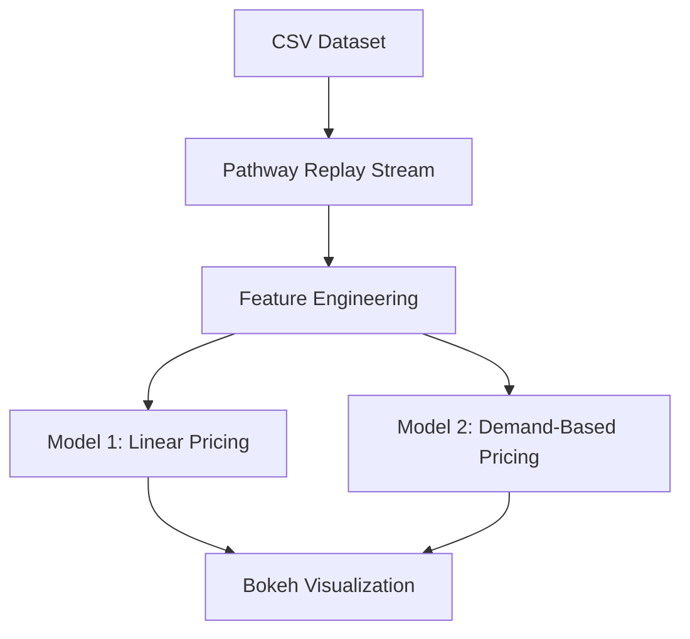

# Dynamic Pricing for Urban Parking Lots  
**Summer Analytics 2025 – Capstone Project**  
**Organized by the Consulting & Analytics Club × Pathway**

---

## 📘 Overview

Urban parking lots often suffer from inefficient utilization due to static pricing systems. This project implements a real-time, data-driven dynamic pricing engine using Python to dynamically adjust parking fees based on occupancy, traffic conditions, vehicle type, and special events.

The goal is to build a pricing model that updates in real-time using only **NumPy**, **Pandas**, **Pathway**, and **Bokeh**, as per the constraints of the problem statement.

---

## 🧰 Tech Stack

| Tool            | Purpose                                 |
|-----------------|------------------------------------------|
| Python          | Core programming language               |
| NumPy, Pandas   | Data processing and feature engineering |
| Pathway         | Real-time stream simulation and logic   |
| Bokeh, Panel    | Real-time visualization                 |
| Google Colab    | Notebook-based development environment  |

---

## 📂 Repository Structure

```
dynamic-parking-pricing/
├── notebook/
│   └── final_notebook.ipynb         # Main notebook with Model 1 and Model 2
├── report/
│   └── Dynamic_Pricing_Report.pdf   # Optional PDF report with explanation
├── data/
│   └── dataset.csv                  # Sample dataset (uploaded manually in Colab)
├── README.md                        # This documentation file
└── requirements.txt                 # Optional dependencies (for local setup)
```

---

## 🧱 Architecture Diagram



---

## ⚙️ Project Workflow

### 1. Data Ingestion
- Load and preprocess the `dataset.csv` file.
- Merge date and time columns into a unified timestamp.
- Sort by time and stream data using `Pathway.replay_csv()`.

### 2. Feature Engineering
- Occupancy rate
- Queue length (simulated from occupancy)
- Traffic congestion (simulated)
- Special event indicator
- Vehicle type weight (inferred)

### 3. Model Implementations

#### Model 1: Baseline Linear Pricing
A simple linear pricing model:
```
Price = Base Price + α * (Occupancy / Capacity)
```

#### Model 2: Demand-Based Dynamic Pricing
A weighted feature-driven pricing model:
```
Demand = 0.6*(Occupancy/Capacity) + 
         0.2*Queue Length - 
         0.1*Traffic + 
         0.1*Special Day + 
         0.05*Vehicle Type Weight

Price = Base Price * (1 + λ * Normalized Demand)
```
Price is bounded between $5 and $20.

#### Model 3: Competitive Pricing Strategy (Conceptual)
- Detect nearby lots using location data
- Compare competitor prices
- Suggest rerouting or adjust pricing
- *Not implemented due to single-location dataset*

---

## 📊 Visualization

Real-time plots are generated using **Bokeh** inside Google Colab.  
Features:
- Time-series line plots of pricing over time
- Interactive dashboards with real-time updates

---

## ▶️ How to Run

1. Clone the repository:
```bash
git clone https://github.com/saikoushiknalubola/dynamic-parking-pricing.git
```

2. Open the notebook in Google Colab:
```
notebook/final_notebook.ipynb
```

3. Upload the dataset manually when prompted:
```
data/dataset.csv
```

4. Run all cells to simulate real-time pricing and visualize results.

---

## 📝 Report (Optional)

The report includes:
- Problem understanding
- Methodology
- Feature engineering
- Model logic
- Observations

Path: `report/Dynamic_Pricing_Report.pdf`

---

## ✅ Submission Checklist

- [x] Problem Overview
- [x] Tech Stack Summary
- [x] Architecture Diagram
- [x] Model Details & Logic
- [x] Fully Working Notebook (Colab-ready)
- [x] Real-Time Streaming + Visualization
- [x] Optional Report Attached
- [x] Public GitHub Repository

---

## 🧾 Reviewer Notes

- All code is implemented using only NumPy, Pandas, Pathway, and Bokeh.
- No external ML libraries used.
- All models are custom-built from scratch.
- The notebook is structured, documented, and reproducible in Colab.

---

## 🙏 Acknowledgments

This project was developed as part of the **Summer Analytics 2025 Capstone Program** conducted by the **Consulting & Analytics Club** in collaboration with **Pathway**.
